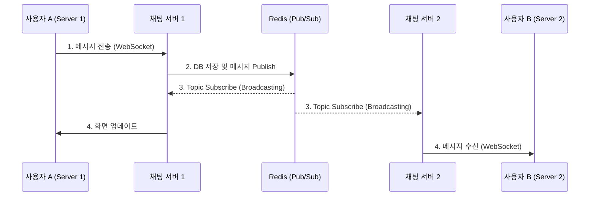
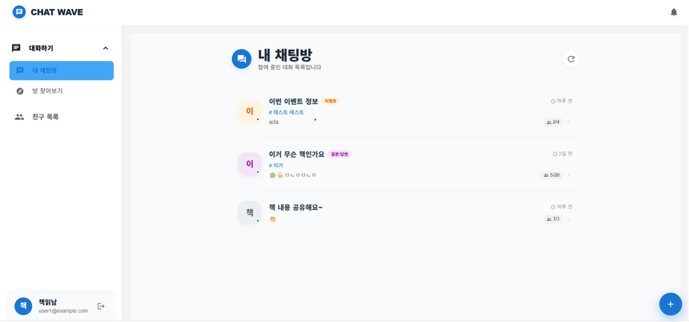
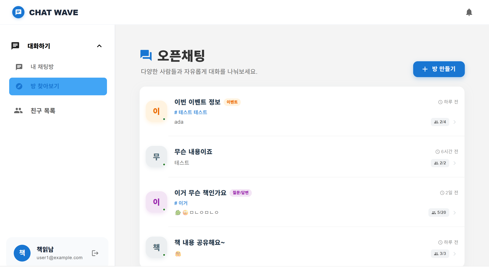
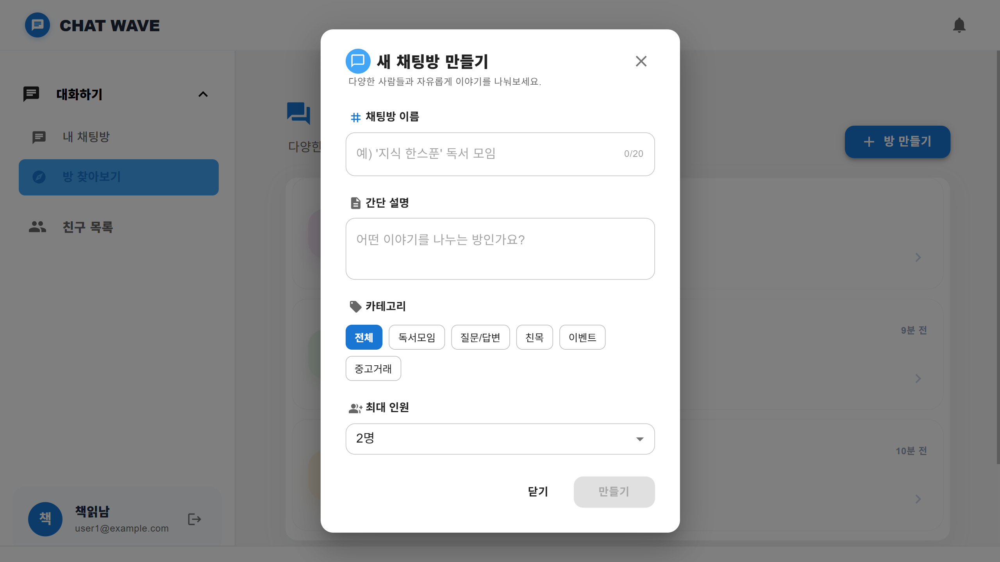
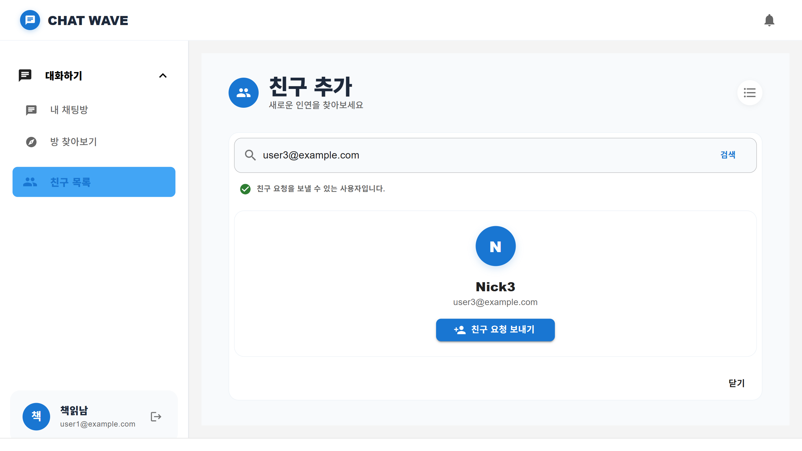
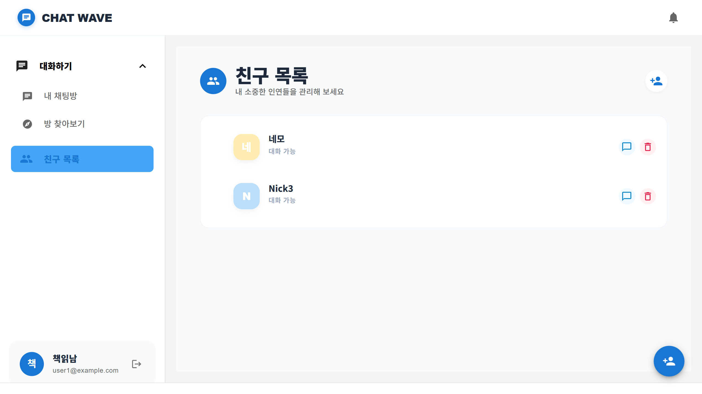
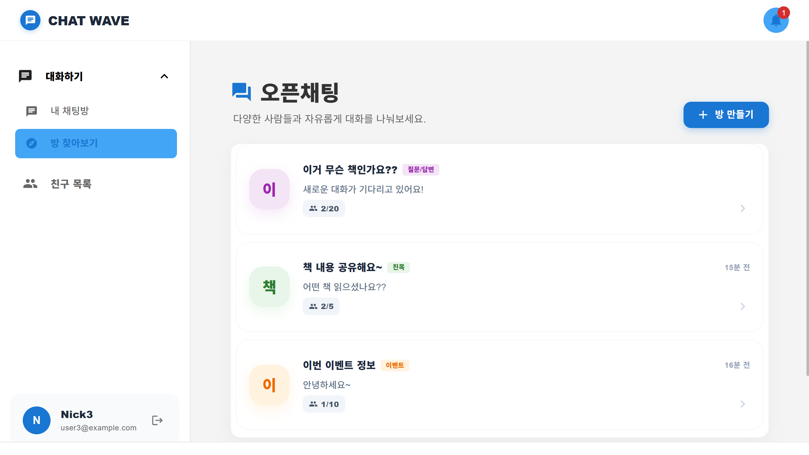
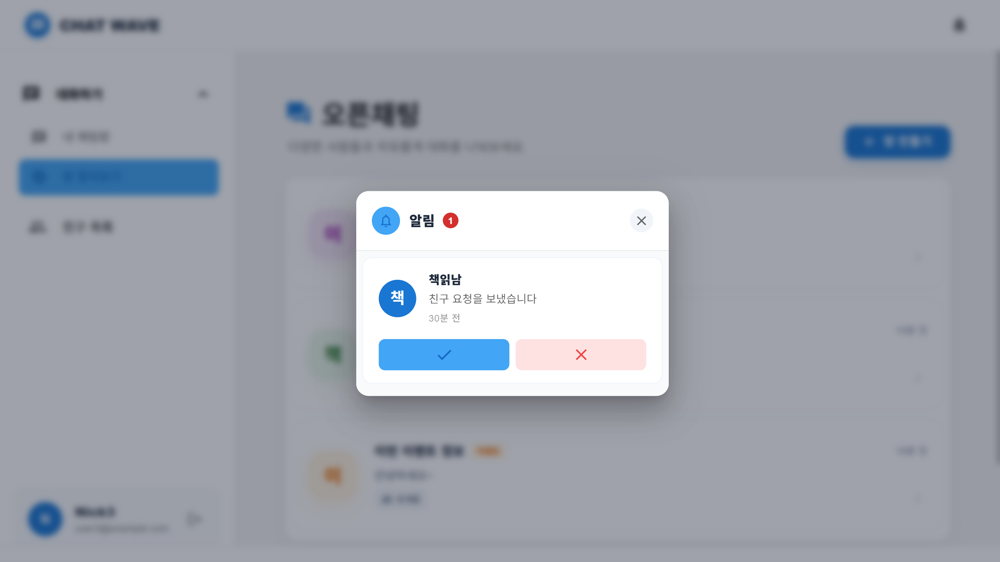
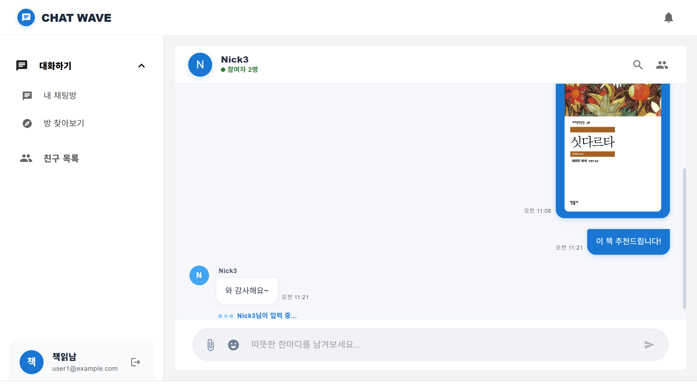

# 💬 CHAT_WAVE

  
  
  
  
  

 

---

## 🛠 Tech Stack & Reason

### Backend
- **Kotlin & Spring Boot 3.x**
- **WebSocket (STOMP)**
- **Redis (Pub/Sub)**
- **Querydsl**
- **Spring Security & JWT**

### Frontend
- **React (Custom Hooks)**
- **Context API**
- **StompJS & SockJS**

---

## 🏗 System Architecture

### 분산 환경에서의 메시지 전파 설계
단일 서버에서는 WebSocket만으로 통신이 가능하지만, **서버가 여러 대인 분산(Scale-out) 환경**에서는 서버 간 세션이 공유되지 않아 메시지 전달이 불가능합니다. 이를 해결하기 위해 다음과 같은 아키텍처를 도입했습니다.

> **[Key Result]**: 서버 대수에 상관없이 실시간 메시지 동기화가 가능하며, 트래픽 증가에 따른 수평적 확장(Scale-out)이 용이한 구조로 구현했습니다.

---

## 📸 UI & Features

### 💬 채팅방 관리 (내 채팅방 / 목록 / 생성)
> 참여 중인 채팅방을 확인하고, 새로운 공개 및 개인 채팅방을 탐색하거나 생성할 수 있습니다.

  
  
  

 

### 👥 실시간 친구 관리 & 🔔 글로벌 알림
> 사용자 검색, 실시간 접속 상태 연동 및 앱 내 전역에서 수신되는 푸시 알림 팝업 기능입니다.

  
  
  
  

 

### 📨 실시간 채팅 (STOMP & Redis Pub/Sub)
> 분산 환경에서도 안정적으로 메시지를 동기화하는 핵심 채팅 룸 화면입니다.

  

